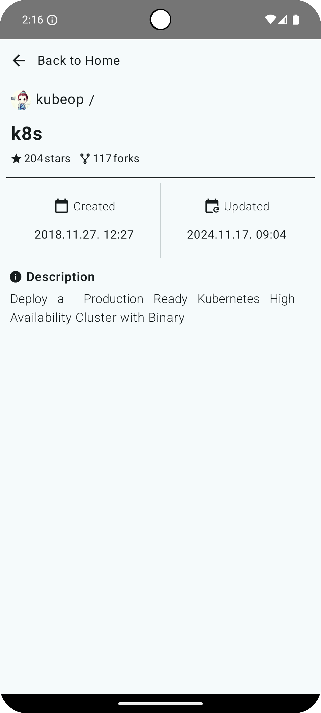

# SearchHub

The main goal of this application is to search github repositories through the GitHub Search API.

## Technologies
- Jetpack Compose
- Clean Architecture
- Retrofit
- Dagger Hilt
- Paging
- Coil

## Features

### Home Screen
On the main page, there is a search bar to initiate the search. If the request yields any results, a list becomes visible. Clicking on the individual repositories allows you to view more details about them.

### Details Screen
On the details page of a repository, you can view the title and description, as well as information about the user who created it and other relevant details. Additionally, you have the option to navigate to the GitHub page of the repository by clicking the title. The same can be done for the user's page by clicking the name.

